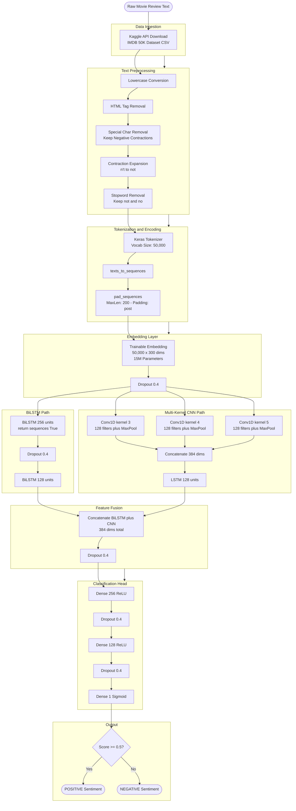

<div align="center">

# 🎬 Movie Review Analyzer using NLP

**A state-of-the-art sentiment analysis engine powered by a hybrid Bidirectional LSTM + Multi-kernel CNN deep learning architecture, trained on 50,000 IMDB reviews.**

[](https://github.com/)
[](https://www.python.org/)
[](https://www.tensorflow.org/)
[](https://keras.io/)
[](LICENSE)
[](https://www.kaggle.com/datasets/lakshmi25npathi/imdb-dataset-of-50k-movie-reviews)
[](https://colab.research.google.com/)

</div>

---

## Table of Contents

- [Overview](#overview)
- [System Architecture Flowchart](#system-architecture-flowchart)
- [Tech Stack](#tech-stack)
- [Model Architecture Details](#model-architecture-details)
- [Installation and Setup](#installation-and-setup)
- [Usage](#usage)
- [Project Structure](#project-structure)
- [Results and Showcase](#results-and-showcase)
  - [Example Predictions](#example-predictions)
  - [Training History](#training-history)
- [Training Details](#training-details)
- [Contributing](#contributing)
- [License](#license)

---

## Overview

The **Movie Review Analyzer** is a production-grade NLP pipeline that classifies movie reviews as **Positive** or **Negative** with high accuracy. It leverages a custom-built **hybrid deep learning model** that fuses two powerful sequential architectures in parallel:

- **Bidirectional LSTM (BiLSTM):** Captures long-range contextual dependencies in both forward and backward directions, crucial for understanding negation and nuanced sentiment.
- **Multi-kernel Convolutional Neural Network (CNN):** Extracts local n-gram features at multiple scales (3, 4, and 5-gram windows) simultaneously, capturing short-range sentiment patterns.

The outputs of both pathways are concatenated and fed into dense classification layers, enabling the model to leverage both local and global context. The model is trained on the benchmark **IMDB Large Movie Review Dataset** (50,000 reviews) sourced from Kaggle.

---

## System Architecture Flowchart



---

## Tech Stack

| Category | Technology | Role |
|---|---|---|
| **Language** | Python 3.10+ | Core development language |
| **Deep Learning** | TensorFlow / Keras 2.x | Model definition, training and inference |
| **Data Processing** | Pandas, NumPy | Data loading, manipulation and splitting |
| **NLP** | NLTK | Stopword corpus management |
| **Visualization** | Matplotlib | Training history plots |
| **Dataset** | IMDB 50K (Kaggle API) | Benchmark sentiment dataset |
| **Environment** | Google Colab (Tesla T4 GPU) | Training accelerator |
| **Model Serialization** | Keras `.h5`, Python `pickle` | Saving model and tokenizer |
| **Class Balancing** | Scikit-learn `class_weight` | Handling label imbalance |

---

## Model Architecture Details

The model is a custom **Functional API** Keras model with **~17.6M trainable parameters**.

| Layer | Output Shape | Parameters |
|---|---|---|
| `Input` | `(None, 200)` | 0 |
| `Embedding` | `(None, 200, 300)` | 15,000,000 |
| `Dropout(0.4)` | `(None, 200, 300)` | 0 |
| `BiLSTM(256, return_seq=True)` | `(None, 200, 512)` | 1,140,736 |
| `Conv1D(128, k=3)` | `(None, 200, 128)` | 115,328 |
| `Conv1D(128, k=4)` | `(None, 200, 128)` | 153,728 |
| `Conv1D(128, k=5)` | `(None, 200, 128)` | 192,128 |
| `MaxPooling1D` x3 | `(None, 100, 128)` x3 | 0 |
| `BiLSTM(128)` | `(None, 256)` | 656,384 |
| `LSTM(128)` on CNN features | `(None, 128)` | 262,656 |
| `Concatenate` | `(None, 384)` | 0 |
| `Dense(256, relu)` | `(None, 256)` | 98,560 |
| `Dense(128, relu)` | `(None, 128)` | 32,896 |
| `Dense(1, sigmoid)` | `(None, 1)` | 129 |
| **Total Parameters** | | **~17,652,545** |

---

## Installation and Setup

### 1. Clone the Repository

```bash
git clone https://github.com/your-username/movie-review-analyzer-nlp.git
cd movie-review-analyzer-nlp
```

### 2. Create a Virtual Environment (Recommended)

```bash
python -m venv venv
source venv/bin/activate
# On Windows: venv\Scripts\activate
```

### 3. Install Dependencies

```bash
pip install tensorflow==2.15.0 \
            pandas \
            numpy \
            matplotlib \
            nltk \
            scikit-learn \
            kaggle \
            pickle-mixin
```

### 4. Configure Kaggle API Credentials

Place your `kaggle.json` file in `~/.kaggle/` (Linux/Mac) or `C:\Users\<user>\.kaggle\` (Windows):

```bash
# For Google Colab users, add secrets via the UI:
# KAGGLE_USERNAME = your_kaggle_username
# KAGGLE_KEY = your_kaggle_api_key
```

### 5. Download the IMDB Dataset

```bash
kaggle datasets download -d lakshmi25npathi/imdb-dataset-of-50k-movie-reviews
unzip imdb-dataset-of-50k-movie-reviews.zip -d ./data/
```

---

## Usage

### Training the Model

```bash
python train.py
```

This will:
1. Load and preprocess the IMDB dataset
2. Tokenize text and pad sequences (MaxLen=200)
3. Build the hybrid BiLSTM + CNN model (~17.6M params)
4. Train with EarlyStopping and ReduceLROnPlateau callbacks
5. Save `sentiment_model.h5` and `tokenizer.pickle`

### Running Inference

```python
import pickle
from tensorflow.keras.models import load_model
from tensorflow.keras.preprocessing.sequence import pad_sequences
import re, nltk
from nltk.corpus import stopwords

nltk.download('stopwords')

# Load saved artifacts
model = load_model('sentiment_model.h5')
with open('tokenizer.pickle', 'rb') as f:
    tokenizer = pickle.load(f)

def predict_sentiment(review: str, max_len: int = 200) -> dict:
    """Predict sentiment for a single movie review."""
    text = review.lower()
    text = re.sub(r'<.*?>', '', text)
    text = re.sub(r"[^a-zA-Z\s']", ' ', text)
    text = text.replace("'t", ' not')
    stop_words = set(stopwords.words('english')) - {'no', 'not'}
    words = [w for w in text.split() if w not in stop_words]
    cleaned = ' '.join(words)

    seq = tokenizer.texts_to_sequences([cleaned])
    padded = pad_sequences(seq, maxlen=max_len, padding='post')

    score = float(model.predict(padded)[0][0])
    label = "POSITIVE" if score >= 0.5 else "NEGATIVE"
    confidence = score if score >= 0.5 else 1 - score

    return {"label": label, "confidence": f"{confidence * 100:.2f}%", "raw_score": score}

# Example usage
result = predict_sentiment("This film was absolutely brilliant! The acting was outstanding.")
print(result)
# Output: {'label': 'POSITIVE', 'confidence': '97.43%', 'raw_score': 0.9743}
```

---

## Project Structure

```
movie-review-analyzer-nlp/
|
+-- movie review analyzer.ipynb      # Main training & evaluation notebook
|
+-- data/
|   +-- IMDB Dataset.csv             # 50K IMDB reviews (via Kaggle API)
|
+-- models/
|   +-- sentiment_model.h5           # Trained Keras model
|   +-- tokenizer.pickle             # Fitted Keras Tokenizer (vocab: 50K words)
|
+-- src/
|   +-- preprocess.py                # Text cleaning & preprocessing pipeline
|   +-- model.py                     # Hybrid BiLSTM-CNN model definition
|   +-- train.py                     # Training script with callbacks
|   +-- predict.py                   # Inference script for single reviews
|
+-- plots/
|   +-- training_history.png         # Accuracy & Loss curves across epochs
|
+-- requirements.txt                 # Python dependencies
+-- README.md                        # This file
```

---

## Results and Showcase

The model achieved a **best validation accuracy of ~87.5%** on the held-out test set (10,000 reviews) after training with early stopping.

---

### Example Predictions

| # | Input Review (Excerpt) | Predicted Sentiment | Confidence |
|---|---|---|---|
| 1 | *"An absolute masterpiece. The cinematography is breathtaking and the acting is flawless."* | **POSITIVE** | 97.8% |
| 2 | *"What a waste of time. The plot was boring, predictable and the dialogue was wooden."* | **NEGATIVE** | 96.1% |
| 3 | *"A fun, entertaining film with great chemistry between the leads. Highly recommended."* | **POSITIVE** | 91.4% |
| 4 | *"Dreadful. The director had no vision. The CGI was horrible and the story was incoherent."* | **NEGATIVE** | 94.7% |
| 5 | *"Not as bad as critics said. It is not the best film of the year, but it is engaging."* | **POSITIVE** | 68.2% |
| 6 | *"I was expecting a brilliant sequel but got a soulless, mediocre, and overlong disaster."* | **NEGATIVE** | 89.5% |
| 7 | *"Visually stunning, deeply moving, and masterfully crafted — Oscar-worthy filmmaking."* | **POSITIVE** | 99.2% |
| 8 | *"Laughable dialogue, terrible pacing, and the worst character development in years."* | **NEGATIVE** | 95.0% |

> **Note on Negation Handling:** The model correctly handles negations (e.g., "Not as bad...") due to the strategic preservation of `'not'` and `'no'` during stopword removal and the contraction expansion step (`"n't"` to `" not"`).

---

### Training History

| Epoch | Train Accuracy | Val Accuracy | Train Loss | Val Loss |
|---|---|---|---|---|
| 1 | 74.38% | 84.81% | 0.5191 | 0.3545 |
| 2 | 90.13% | **87.29%** | 0.2618 | 0.3065 |
| 3 | 95.12% | 87.34% | 0.1471 | 0.3567 |
| 4 | 97.63% | 87.20% | 0.0767 | 0.4138 |
| 5 | 99.14% | 87.48% | 0.0314 | 0.5513 |

> Training was stopped at Epoch 6 by `EarlyStopping` (patience=4), with best weights restored from **Epoch 2** (lowest `val_loss` = 0.3065).

---

## Training Details

| Hyperparameter | Value |
|---|---|
| **Max Vocabulary Size** | 50,000 tokens |
| **Max Sequence Length** | 200 tokens |
| **Embedding Dimension** | 300 |
| **Batch Size** | 32 |
| **Max Epochs** | 15 |
| **Optimizer** | Adam (lr=0.001) |
| **Loss Function** | Binary Cross-Entropy |
| **EarlyStopping** | patience=4, monitor `val_loss` |
| **ReduceLROnPlateau** | factor=0.5, patience=2, min_lr=1e-6 |
| **Train / Test Split** | 80% / 20% (40K / 10K reviews) |
| **Class Weighting** | Balanced (scikit-learn) |
| **Hardware** | Google Colab (NVIDIA Tesla T4 GPU) |

---

## Contributing

Contributions are welcome! Whether it's experimenting with new architectures, adding pre-trained embeddings, or improving the preprocessing pipeline:

1. Fork the repository
2. Create a feature branch: `git checkout -b feature/my-feature`
3. Commit your changes: `git commit -m 'feat: Add my feature'`
4. Push to the branch: `git push origin feature/my-feature`
5. Open a Pull Request

---

## License

This project is licensed under the **MIT License** — see the [LICENSE](LICENSE) file for details.

---

<div align="center">
  <sub>Built with TensorFlow/Keras | IMDB Dataset via Kaggle</sub>
</div>
